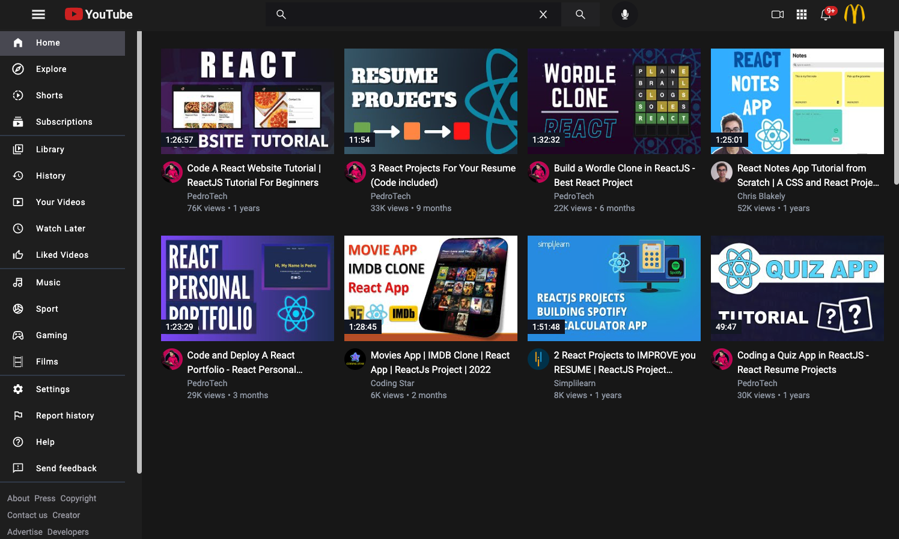
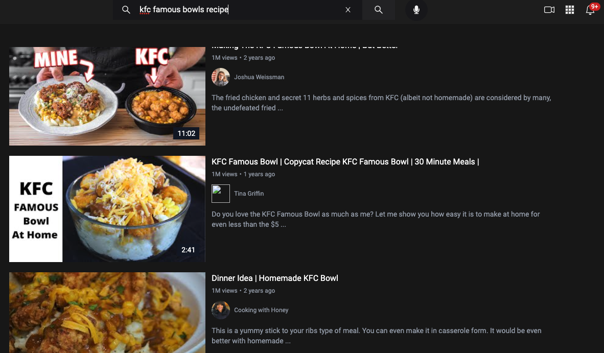
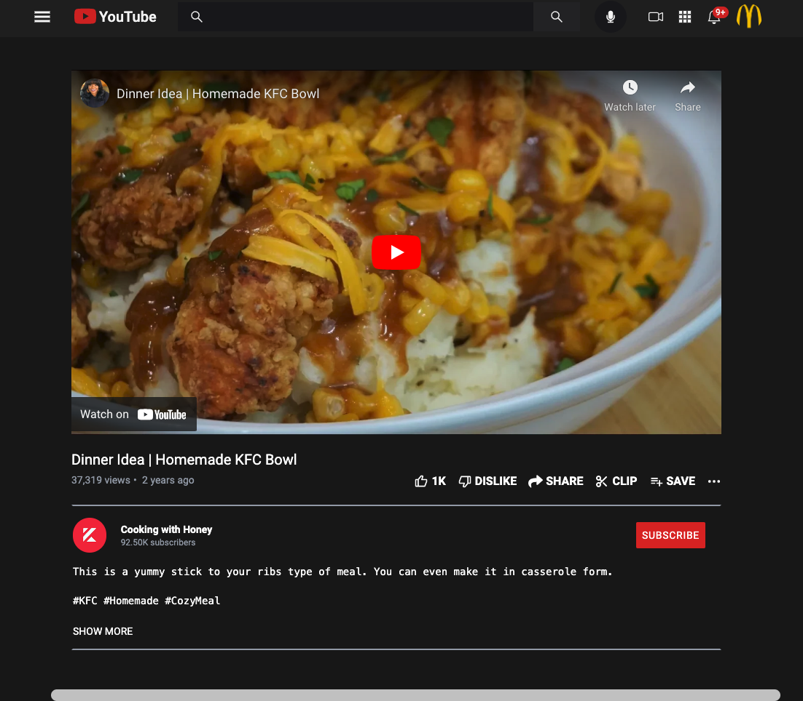

# YOUTUBE CLONE

A YouTube clone that uses react, react-router-dom, tailwindcss, and google cloud api.

Final App deploy: https://slacken-1.web.app

<h1>Home Page</h1>
  
  <h1>Search Page</h1>
  
  <h1>Watch Page</h1>
  

## Features

REACT

REDUX

TAILWINDCSS

REACT ROUTER

REACT ICONS

REACT INFINITE SCROLL

AXIOS

GOOGLE CLOUD API (YOUTUBE)

GOOGLE FONTS
